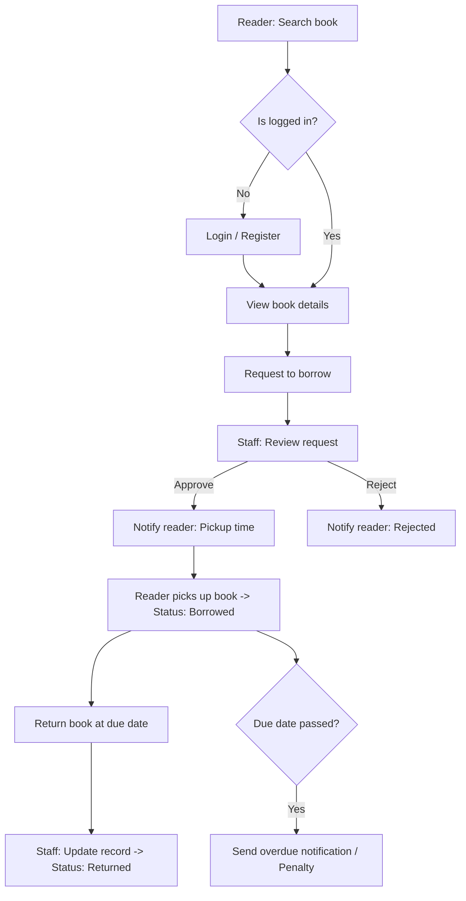

# Library-Borrowing-Management-System  
<b> Link project: </b> [Code](https://github.com/lthnhuw/B2106803_LeThiHuynhNhu_project)
## 1. Project Overview  
- <B> Objective: </B> Automate and streamline the library book borrowing and returning process to improve efficiency and user experience.
- <B> Problem: </B> Manual management caused delays, lack of transparency, and difficulties in searching/monitoring overdue books.
- <B> Stakeholders: </B> Library staff (administrators) and readers (users).

## 2. Business Needs & Goals  
- Provide a centralized platform for readers to search, borrow, and track books.
- Enable staff to manage books, publishers, and borrowing/returning activities efficiently.
- Reduce manual workload and improve data accuracy with real-time tracking.

## 3. Requirement Analysis  
### Functional Requirements  

| Readers                                    | Staff                                    |
|------------------------------------------------|----------------------------------------------|
|Register, login, and manage personal account.|Manage books and publishers (add/edit/delete).|
|Search books, view details, borrow and return books.| Approve or reject borrowing requests.|
|Track borrowing history.|View reports and statistics on borrowing activity.|

### Non-Functional Requirements  
- Simple, user-friendly interface.
- Secure account management (authentication, data protection).
- Scalable system for larger datasets.

## 4. Business Analysis Techniques  
- <B> Use Case Diagram: </B> Modeled interactions between staff and readers.

- <B> Class Diagram:</B> Defined data entities (Readers, Staff, Books, Publishers, Borrowing Records).
  
- <b> Process Flow: </b> Described borrowing and returning workflows.

- <b> Wireframes: </b> Designed UI mockups for staff and reader portals.
  

## 5. Key Deliverables  
- Use Case Diagrams (Registration, Login, Borrow/Return, Management).
- Class Diagram with entity attributes and relationships.
- Wireframes for main user interfaces (Login, Search Books, Borrowing History, Management Dashboard).
- Requirement specification document with functional & non-functional requirements.

## 6. Evaluation & Improvements  
- Lim itations identified:
  -  Missing password recovery feature.
  -  Limited UX optimization for readers.
  -  No profile update function for readers.
- Proposed enhancements:
  - Add account management features (profile editing, password recovery).
  - Improve responsive design for better user experience.
  - Add admin dashboard for monitoring all readers.
 
## 7. Skills Applied  
Requirements Analysis, UML (Use Case, Class Diagram), Process Modeling, Wireframing, UX Evaluation, Documentation.  

## 8. Reflection  
Through this project, I gained hands-on experience in analyzing business needs, documenting system requirements, and modeling workflows. I also learned how to bridge business requirements with potential technical solutions, a crucial skill set for a Business Analyst Intern.
